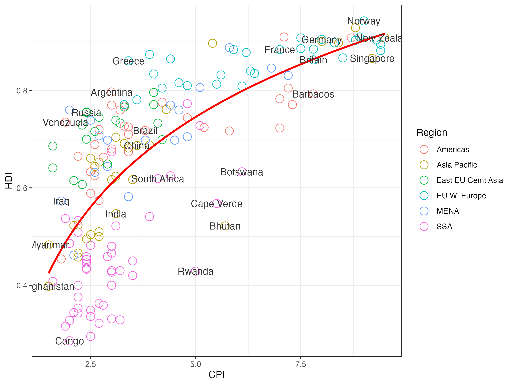

# 🌍 Economist Data Visualization (CPI vs HDI)

## 📌 Overview
This project visualizes the relationship between the **Corruption Perceptions Index (CPI)** and the **Human Development Index (HDI)** using the Economist dataset.  
It reproduces a classic plot showing how corruption levels correlate with human development across different regions.

## 📊 Dataset
- **File:** Economist_Assignment_Data.csv  
- **Observations:** ~173 countries  
- **Features:** CPI, HDI, Region, Country  

## ⚙️ Tools & Libraries
- R (ggplot2, dplyr)
- Techniques: Scatterplots, Regression (log model), Faceting, Thematic styling

## 🔍 Approach
1. Data cleaning: removed unused columns  
2. Scatterplot: CPI vs HDI, colored by region  
3. Added regression line with `log(x)` fit  
4. Labeled key countries (Russia, India, US, etc.)  
5. Applied `theme_bw()` and custom scales for CPI & HDI  
6. Finalized with professional titles and axis labels  

## 📈 Key Visualization
  

*(You can export the final ggplot as PNG and save it in a `plots/` folder.)*

## 🚀 Future Work
- Add interactive version using **Plotly**  
- Explore time-series comparisons across years  
- Build a Shiny dashboard  

## 📂 Project Structure
```
economist-visualization/
│── README.md # Project documentation
│── Economist_visualization.R # R script with all plots
│── Economist_Assignment_Data.csv # Dataset
│── plots/ # Exported figures 
```
